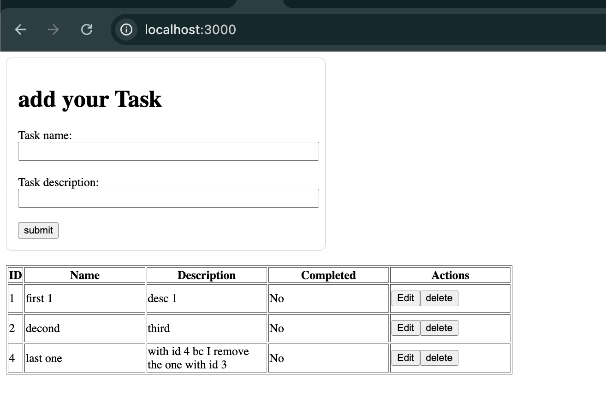

# Installing

- you should use java 21 you can get it from [here](https://docs.aws.amazon.com/corretto/latest/corretto-21-ug/downloads-list.html)

- you should use node version 24.5.0

- First go to the root of the project and execute this command `mvn clean install && java -jar ./target/taller-0.0.1-SNAPSHOT.jar`

- in a new terminal execute the following commnad  `cd react && npm install && npm run start`

- Inside the folder `./src` live the Java code using spring.

- Inside the folder `./react` live the React code.

# Docker
if you do not want install java/node you can execute this commnad `cd docker && docker-compose up -d`. (wait around 20 seconds) then go to `http://localhost:3000`.  

The backend project is running on port 8080, make sure you do not have anything running there.

